# GCPTemplate

Create Google App Script Web Apps with Google Service Backends. Template comes pre-built with a simple web app containing a single input form which updates the A1 cell of a linked Google SpreadSheet. See below an animated GIF of switching from an empty spreadsheet, navigating to the web app, submitting a new value, then verifying the value submitted is shown within the A1 cell of the original spreadsheet.

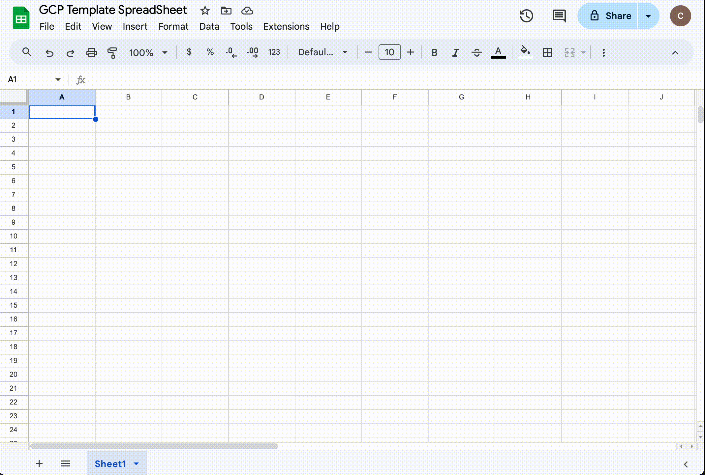

## Contents

1. [TL;DR](#tldr)
2. [Setup](#setup)
    - [Log into Clasp](#log-into-clasp)
    - [Create Google App Script Project](#create-google-app-script-project)
    - [Add Script Properties](#add-script-properties) 
    - [Deploy Project](#deploy-project)
3. [Related Projects](#related-projects)

## TL;DR

Starting a web project always seems so difficult. Hundreds of questions seems to inject themselves into my mind. What language and technologies should I use? Where will I deploy the result? (Basically all the questions that have nothing to do with the project itself).

After running through this cycle a number of times, I decided to create a template to allow me to focus on project implementation rather than project infrastructure. 

At its initial state the template gives you a baseline javascript web app that runs a React frontend hosted by a Google App Script (GAS) backend. While Google App Script is usually used for automating business processes across multiple Google Services, it can also be a platform for hosting web applications. Unfortunately, the App Script Web-based IDE is not very user friendly when it comes to building performant SPAs. Luckily webpack allows transpilation of modern JavaScript syntax and functionality to more native and widely supported versions of the JavaScript language. By combining the power of webpack, react and Google App Script (via the Clasp CLI), we can create modern-looking web apps with your already familiar Google Services. This template comes pre-built with an example call to the GAS backend which updates a single cell within a Google Spreadsheet but gives you the bare framework to add as many Google Service integrations you want.

Essentially, think of this as a React SPA with a Google Sheets database. And while it does sound a little in-formal and definitely less cool than setting up a Kubernetes cluster of five different images spread over twenty containers, this GCP React Template is honestly all you need to build efficiency in your small business or even your daily life without any major technical hurdles.
All code for the "frontend" is stored under `src/client` and all code for the "backend" is stored under `src/server`. To make calls between the client and server directories, a global function must be declared within the `code.ts` file of the server directory, and the client calls this function via a `google.script.run` function call as shown below:

```javascript
// src/server/code.ts

// @ts-ignore
global.FormSubmit = (formData) => {
    const scriptProps = PropertiesService.getScriptProperties();

    const sheetId = String(scriptProps.getProperty('MAIN_SHEET_ID'));
    const sheet = SpreadsheetApp.openById(sheetId).getSheets()[0];
    
    sheet.getRange(1, 1).setValue(formData.newValue);
}
```

```javascript
// src/client/root.tsx

public handleSubmit = (e) => {
...
    // @ts-ignore
    google.script.run
    .withSuccessHandler(this.handleFormSuccess)
    .withFailureHandler(this.handleFailure)
    .FormSubmit(document.getElementById('form'));
...
}
```

The `withSuccessHandler` and `withFailureHandler` functions allow you to set callbacks for both a successful and unsuccessful response from your backend `FormSubmit` call. As you can see the last function to be called is the function you defined within the server side `code.ts` file. For more information about the client side API for `run` please reference [Google's Documentation](https://developers.google.com/apps-script/guides/html/reference/run).

With some of the basics out of the way, you should be able to hit the ground running by setting up your very own Google App Script Web App. Keep in mind this is just a template so feel free to add more complex UI dependencies or more Google Service integrations into your very own implementation! Hopefully this template helps you worry less about the backend and gets you more time implementing your awesome ideas! 

## Setup

### Log into Clasp
Within your terminal, run the `bun install` command.
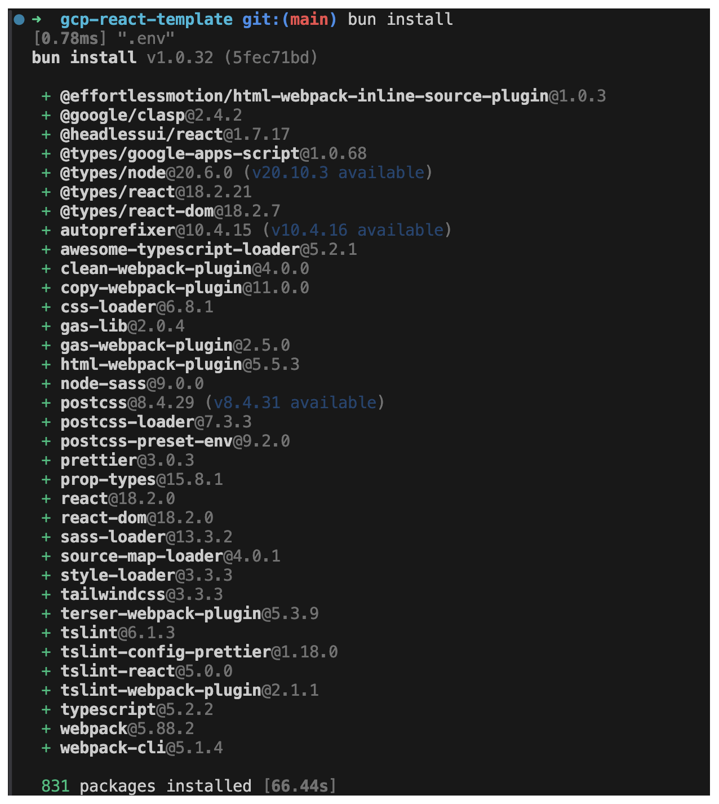

Next, run `bun run login` (If you haven't logged in recently). This command will log you into your google account to allow the project to create and update google cloud projects.

After running the command, the terminal should direct you to a web view to log you into your google account.


Continue with the web view prompts, including reviewing of access needed for clasp to manage your new web application.
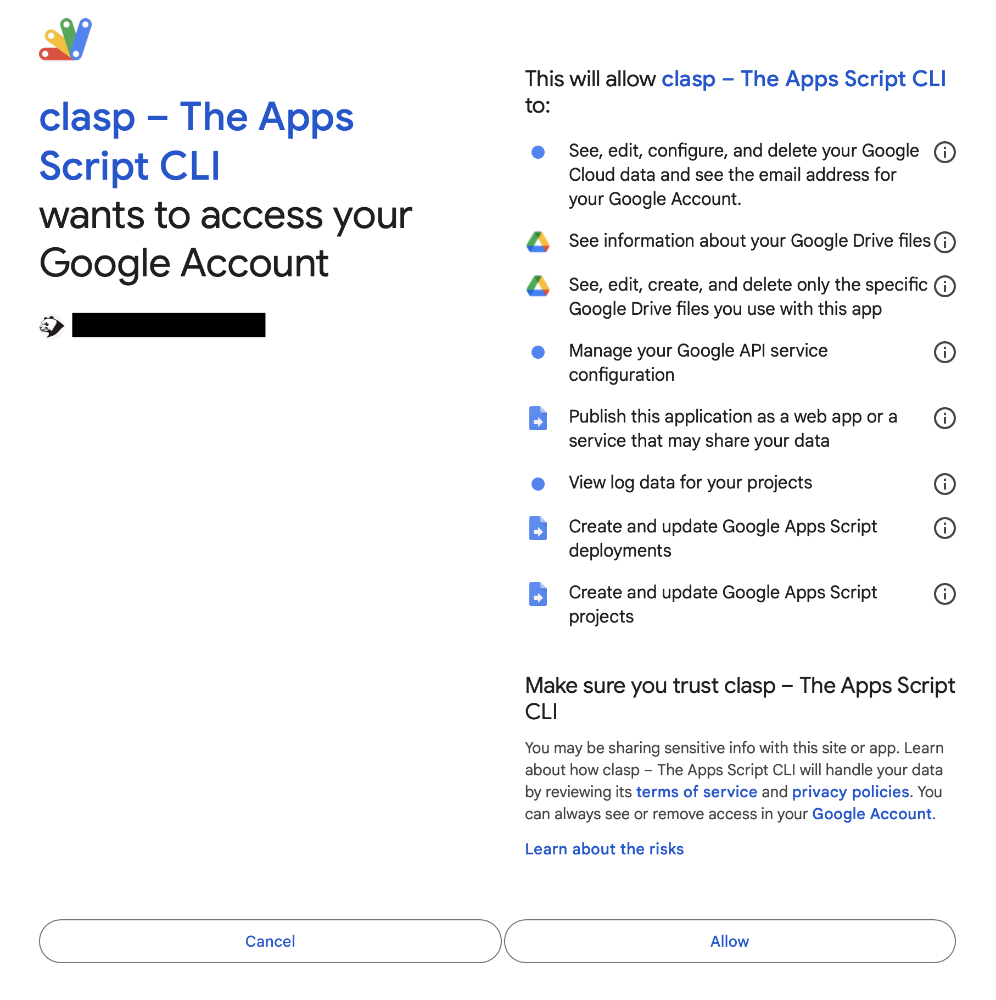

Once you have completed the entire login and permission review process, you should be redirected to a confirmation view.
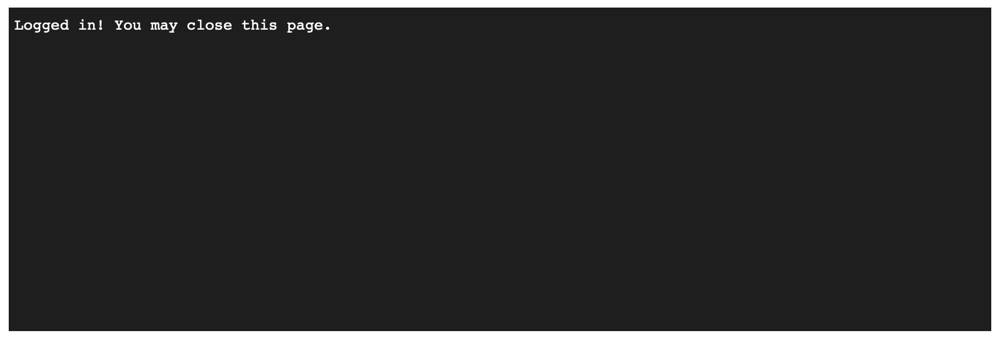

### Create Google App Script Project

Now you have logged into your Google Account via Clasp, you can now use Clasp to create a new project form which your react code will be deployed to. To do this, run `bun run create <project name>`.
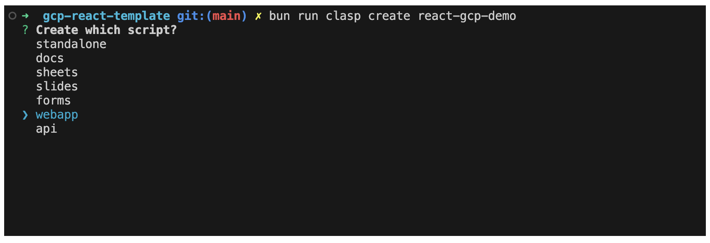

Select `webapp` when prompted for type of script to create.

Once the project is successfully created, you should see the following output.
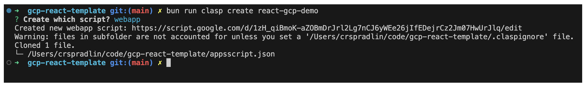

### Add Script Properties
Now create a new Google Spreadsheet to allow the web application to send and receive updates to. See the screenshot below to retrieve the I.D. of the new Spreadsheet. The I.D. will be needed within a Script Property in order to connect the web application to the spreadsheet. The Spreadsheet I.D. will be the series of letters, numbers and characters between the `/d/` and `/edit/` portions of the url.
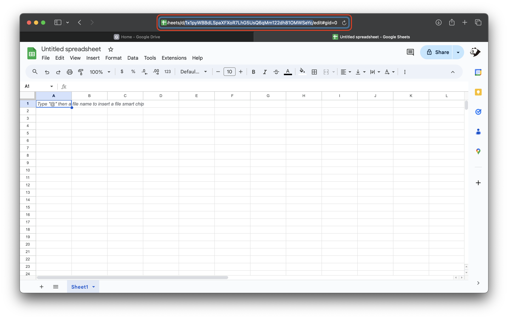
In the above example, the I.D. of the document is `1x1pyWBBdLSpaXFXoR7LhG5UsQ6qMm122dh81OMWSeYc`. Your I.D. should look similar. Save this value somewhere to be used in the following steps.

Navigate back to your terminal where you entered the `bun install` and `bun run login` commands. Once there, run the `bun run open` command.

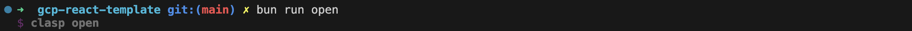

The command should open a web view of your clasp (Google App Script) project.

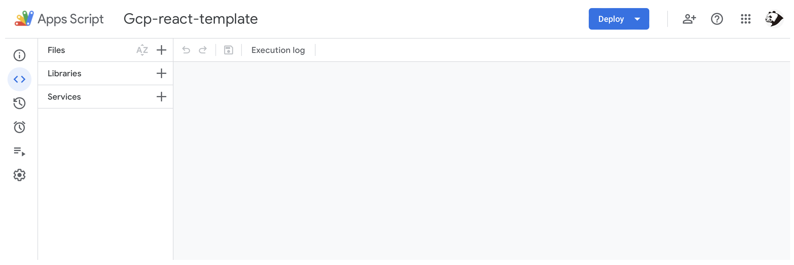

Navigate to the gear icon on the left side panel. It should expand to say `Project Settings` when it is hovered over with your cursor. Click `Project Settings` to open its page.

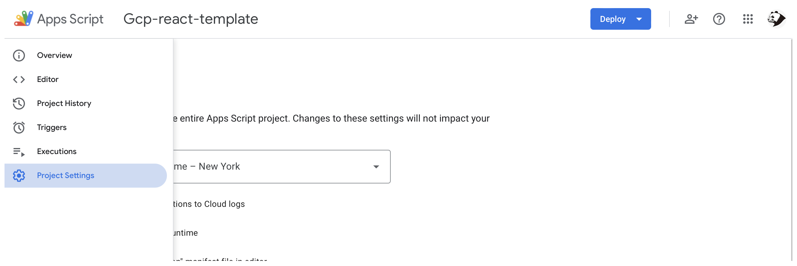

Once on the `Project Settings` page, scroll to the very bottom section which reads `Script Properties`. Click on the `Edit script properties` button.

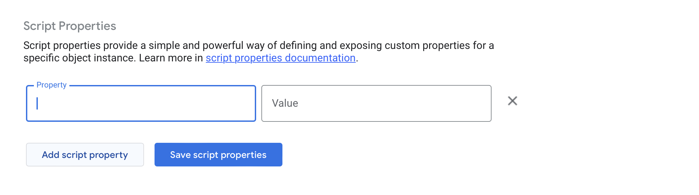

The `Property` value for your new Script Property should be `MAIN_SHEET_ID`. The `Value` should be set to the Google Spreadsheet I.D. we retrieved in the previous steps.

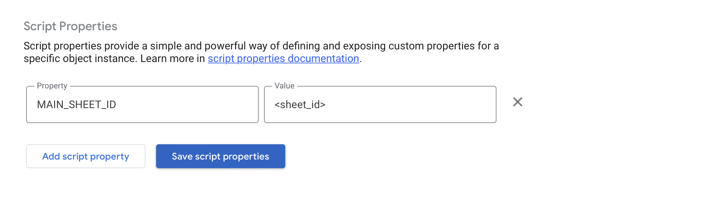

Once both fields are filled in, click the `Save script properties` button.

### Deploy Project
Since we have already created the clasp project and set up the script properties, all we need to do is deploy the application code to the newly created project.

To deploy the current code in your repository run in your project's terminal `bun run deploy-test`.

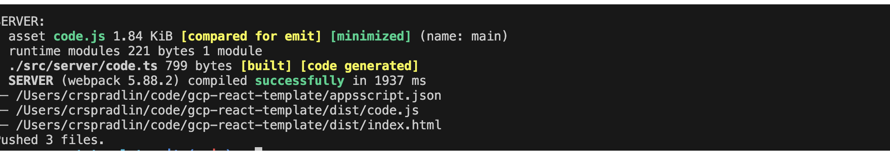

You have now successfully compiled and uploaded the src files over to your newly created clasp project. You can now view them by running `bun run open`

Even though we have uploaded the code to the project, we still have not gotten a URL to run our newly created web application. To do so, we will need to configure the deployment within the Google App Script UI.

If you have not already done so, navigate to the project dashboard by running `bun run open`

You should now be able to view your project's deployed code. This was also the location of where we updated the script properties. 

In the top right corner of the dashboard you should see the `Deploy` button. Click this button and select `New Deployment` in the dropdown.

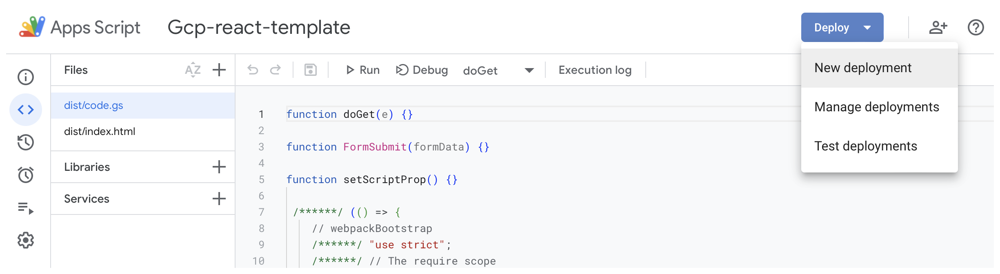

Within the modal that pops up, click the top left gear icon and select the `Web app` option in the dropdown.

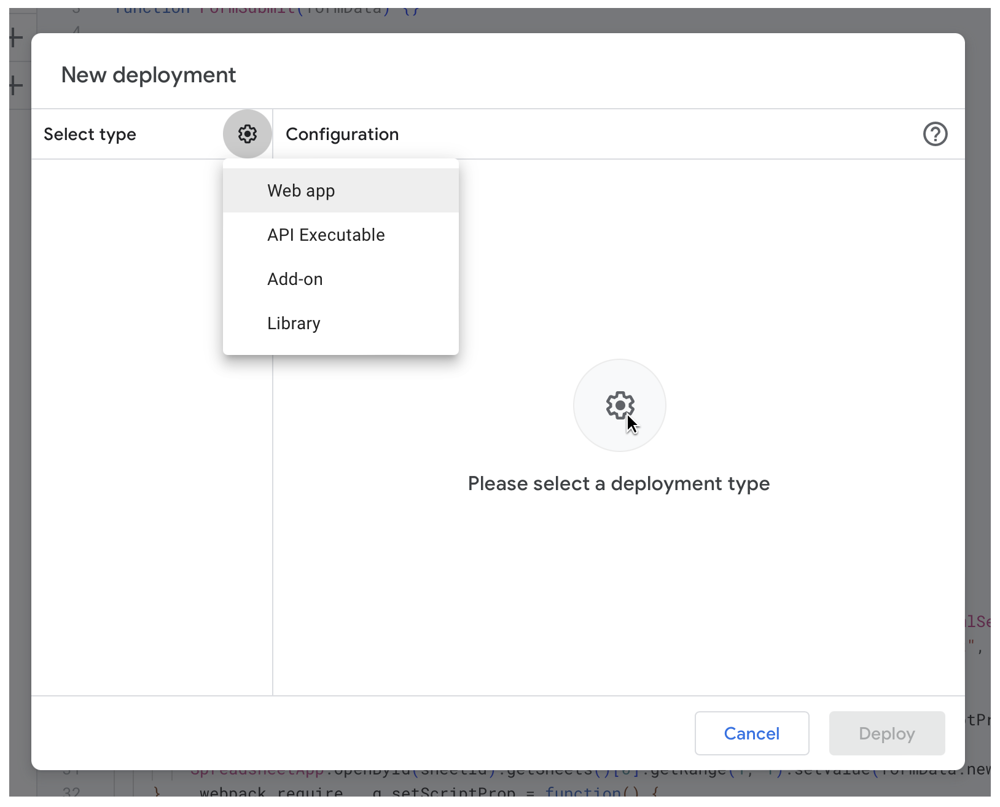

Within the new deployment configuration form, enter the necessary details for your web application.

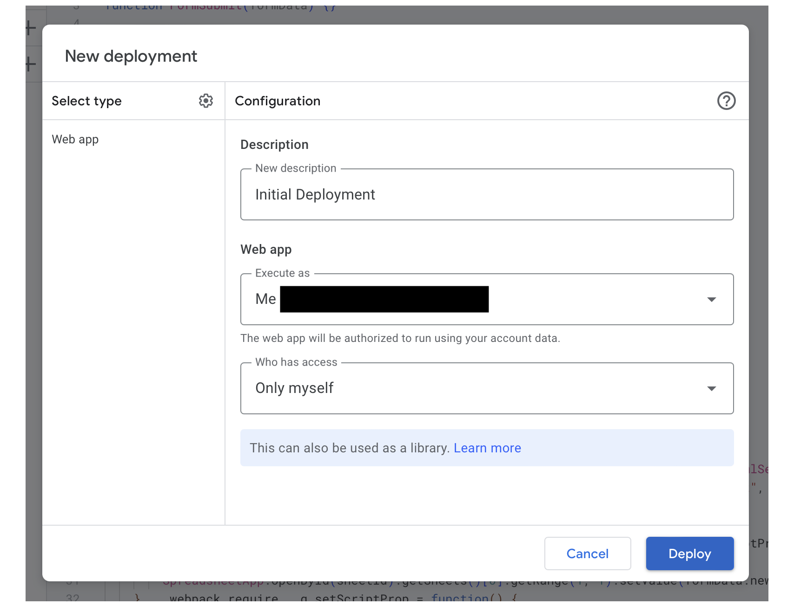

For the time being, ensure the `Execute as` and the `Who has access` is selected to your gmail account associated with this project and `Only myself` is selected for access. You can always come back and change these later to grant access to the larger public audience.

Now click the `Deploy` button.

If you are deploying for the first time, you will now receive a set of prompts requesting access to allow Google App Script to execute the code you have uploaded. You should only have to do this once, unless later down the road you decided to connect to additional Google Services.

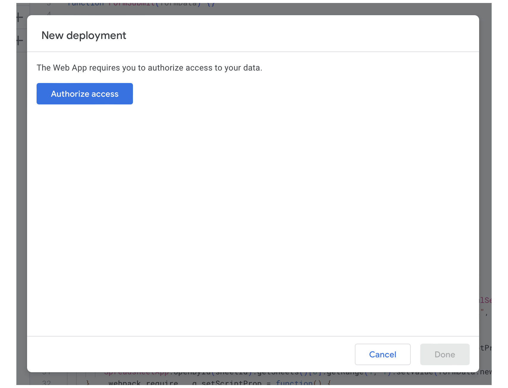

Click `Authorize access` to begin granting access to your new Web App deployment.


Within this prompt, click the `Advanced` click on the bottom left.

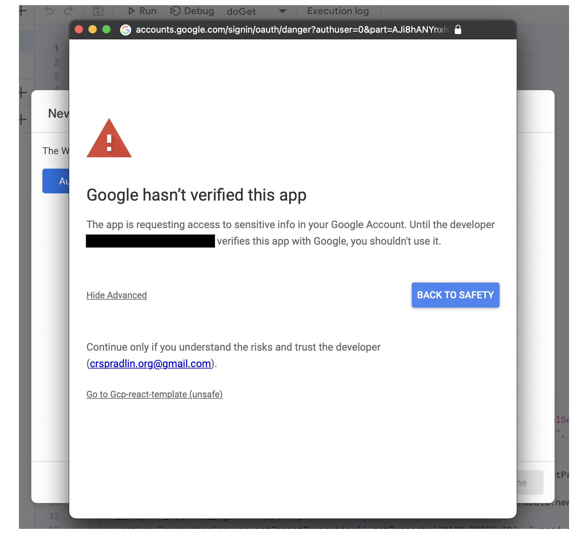

Now select the `Go to ...` link at the bottom to proceed with reviewing the permissions needed for the web app deployment.

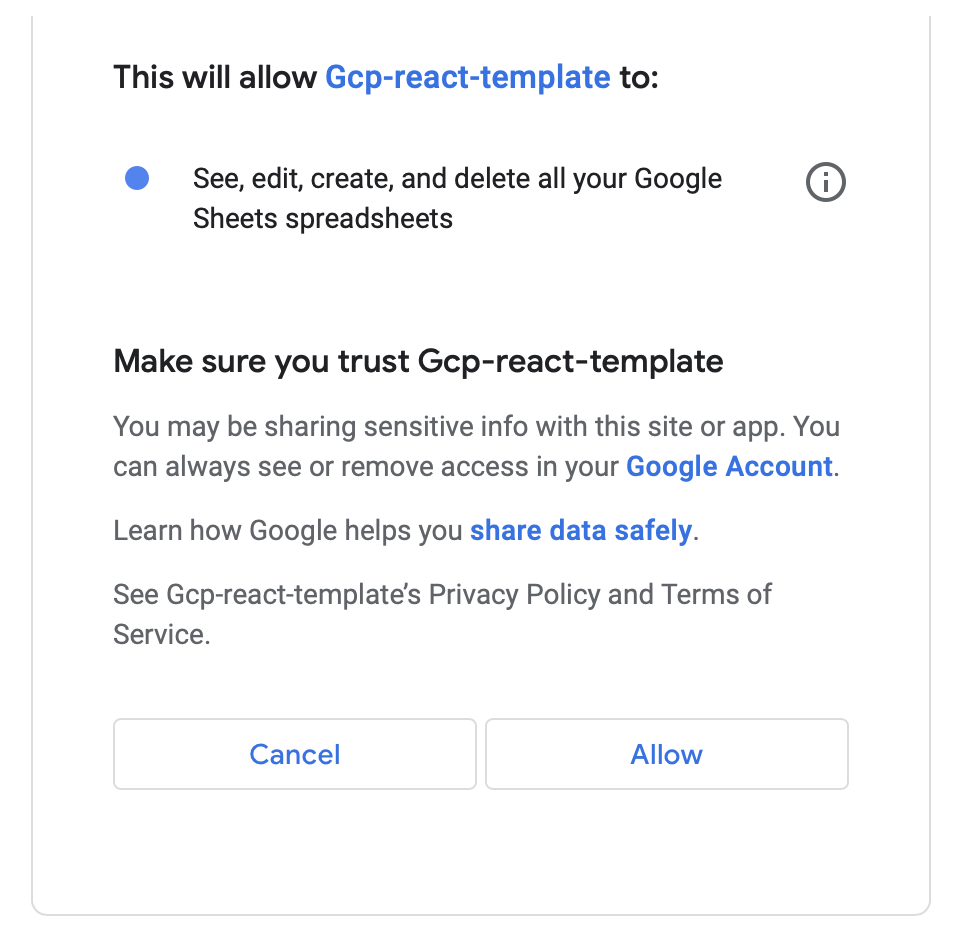

Review the list of permissions needed by the app and select the `Allow` button at the bottom.

You should now see the finished deployment screen with a URL you can use to access your newly created web app!

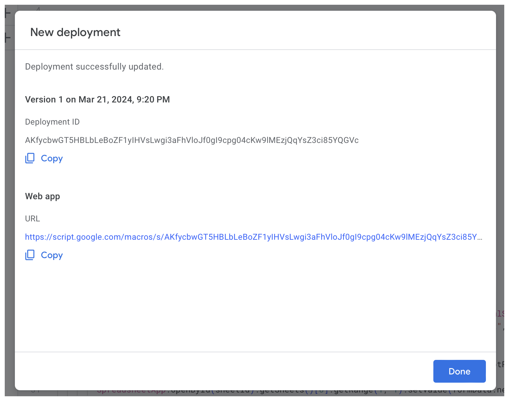

Lastly, after you have performed your initial deployment, move back to your terminal within your project and run the `bun run update` command to pull down the manifest file created during your initial prod deployment.

Lastly, in order to deploy your code to this URL each time, since a new deployment will create a different URL, you can save the deployment I.D. on the screen to an `.env` file at the root level of your project directory.

If you choose to go this route, just ensure your deployment I.D. is under the key `PROD_DEPLOY_ID` as shown below.

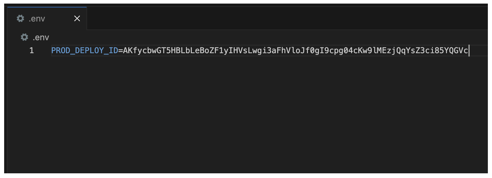

With this environment configuration, running `bun run deploy-prod` will use your saved deployment I.D. to update the already created URL. No need to generate a new URL for each change in your code base!

Likewise, running deploy-test will update your test environment which you can access under the `Deploy` dropdown in the App Script Dashboard under `Test Deployments`.

## Related Projects

[React-Google-Apps-Script](https://github.com/enuchi/React-Google-Apps-Script/blob/main/webpack.config.js): Really helped kickstart this project and aided with my own perils of how webpack works.

[budget-app](https://github.com/CRSpradlin/budget-app): An example use case of this template; created by me to help aid recording and budgeting my monthly expenses. I use this nearly every day.

 [dirtyspokes-series-app](https://github.com/CRSpradlin/dirtyspokes-series-app): A more niche use case of this template; created by me to help a local trail running company keep track of series points for semi-annual awards to top runners in the district.
