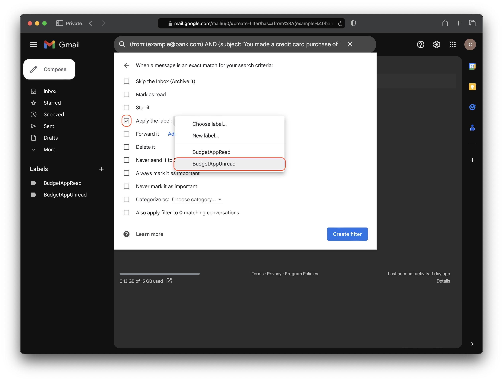

# GCPBudgetApp

## TL;DR
Gives users and developers the ability to host their own budget web application through Google Cloud's App Script Service. Typically App Script Applications are little one-off scripts that give users the ability to connect mulitple Google Services together or give the ability for developers to add additionally functionality to their SpreadSheets or Documents. In the case of the GCPBudgetApp, AppScript is leveraged to host a small web application which graphically displays any recent purchases performed by the user. Recent purchases are gathered via Gmail labels, one label denotes a new email with a new purchase, the other label denotes a purchase has already been read.

## Setup

### Create Google Cloud Project
Clone down the repository and run an `bun install`.

Run `bun run clasp login`.

The `clasp login` command will open a browser window to have you sign-in to your Google/Gmail account. Ensure you use the account you want to have the budget app recieve and manage your bank transaction emails. Click `Allow`.

Allow Google App Script API. If you have not done so, navigate to [https://script.google.com/home/usersettings](https://script.google.com/home/usersettings) and ensure the App Script API is enabled as shown below. 

Enable the App Script API

Next, run `bun run clasp create <project name>` in the cloned down repository. 

Select `webapp` for the project type when prompted.

Next, you need to configure your bank email notifications and add two new Gmail labels, one to mark the emails as new unread transactions and the other for the web-app to leverage marking transactions as read.

### Enable Bank/Card Transaction Notifications
Most banks and credit card providers have the ability to send you notifications on any transactions made over a certain amount. By setting the transaction amount to a small amount like `$0.01` or similar, email notifications can be sent for almost all transactions. These emails will then be picked up by the bugeting app along with their transaction amounts so you can keep track of your purchases. 

### Add New Labels to Gmail
Create a new label for all the unread transactions you will recieve from your bank. If you already 

1. Navigate to your Gmail account and click the `create new label` plus button.

2. Fill in the new name for your unread transactions label. In this case, the label name is `BudgetAppUnread` but it can realisitically be anything. Just remember which label you want to act as the unread transactions and which label will act as the read transactions.

3. Create the second label for your read transactions. In this case, the label name is `BudgetAppRead` but it can also be anything you want.

### Apply Filter Parameters for Unread Label
Once you've created your two labels or already have labels that you can re-purpose in your Gmail account, the next step would be to apply a filter to automatically place inbox items to your unread label.

1. Click on the `show search options` button to the right of the search box.

2. Fill in the search options to target emails from your bank. 

Replace `<enter filter parameters here>` with a filter which targets the subject and bank email address. As an example, lets say the bank send their notification email from the email address: `example@bank.com`, and lets say the subject of those notification emails contain the words `You made a credit card purchase of` followed by the transaction amount. With this information, we can create a filter that looks for that particular subject from the bank's email address: `(from:(example@bank.com) AND {subject:"You made a credit card purchase of "})`. Place this newly created filter parameter under the `Has the words` field. Once you have set your filter parameters, click the `Create Filter` button.

3. On the next page for creating a filter, select the `Apply the label` option and select the **UNREAD** label. By selecting this option, any new messages to your email with the subject you specified and from the specified bank email address will now have the unread label assigned to it.

You may also want to select the `Skip the Inbox (Archive it)` option if you do not want your inbox to be riddled with transaction emails. I personally don't have this option selected since I like recieving notifications about any new transactions but if that gets or sounds anoying this option can be selected. Selecting the `Skip the Inbox` option does not affect the functionality of the budget application.
Once finished you can click the `Create Filter` button.

### Create Budget Spreadsheet
A spreadsheet is needed by the budget app in order to store and retrieve. Navigate to your Google Drive and create a new Spreadsheet.  After creating a new Google SpreadSheet and giving it a name of your choice, select and copy the entire sheet URL as shown below.  The URL should look something like `https://docs.google.com/spreadsheets/d/XXXX/edit#gid=0` where the `XXXX` in the example is a long string of numbers and characters. This value is the SpreadSheet ID. Save this value somewhere since we will be needing it for the following step.

### Configure Properties in Budget App (Labels and Sheet ID)
Now that the labels have been created, we can now configure them in the budget app so that they can be used to identify and mark incomming transactions.

1. Navigate back to the repository that you have cloned down and ran the previous `clasp` commands to create a new Google Cloud Project.

2. Run `bun run clasp open`.  After running the `clasp open` command, your browser should be opened at the project you've created earlier. Be sure the browser is logged into the same account you've used within the `clasp login` command you performed earlier. 

3. Click on the settings icon in the left pane of the App Script Web IDE.  Scroll to the bottom of the page or until you see the `Script Properties` section. 

4. Click on the `Add script property` button until three new fields are showing. 

5. Fill in the script properties as shown below.

    |Property|Value|
    |---|---|
    |EMAIL_READ_LABEL|budgetappread|
    |EMAIL_UNREAD_LABEL|budgetappunread|
    |MAIN_SHEET_ID|XXXX|

    `EMAIL_READ_LABEL`: The value for this property should be the name of the **read** label you created in the [Add New Labels to Gmail](#add-new-labels-to-gmail) section.

    `EMAIL_UNREAD_LABEL`: The value for this property should be the name of the **unread** label you created in the [Add New Labels to Gmail](#add-new-labels-to-gmail) section.

    `MAIN_SHEET_ID`: The value for this property should be the I.D. of the SpreadSheet you created and saved from the [Create Budget Spreadsheet](#create-budget-spreadsheet) section.

### Deploy Your Budget App
Now that the project has been created and the properties have been applied, you can now move forward with creating your first prod deployment and test deployment.

1. Navigate back to your locally cloned version of the code base where you intitially ran the `clasp` commands. Run `bun run deploy-test` command.

2. Open or navigate back to the project within Google App Script. You can either open the project back up using the [script.google.com](https://script.google.com) or run the `bun run open` command.

3. Click on the `Deploy` dropdown and click `New deployment`. At which point the new deployment modal will show. Ensure you have selected a Web App deployment type by click the gear icon next to `Select Type`. Enter the following information for the new Web App Deployment.

For the `Description` field you can put whatever you'd like. In this case I elected to just put `Prod Deployment`.
The `Execute as` field determines who the application should execute its code as. Since we are planning to be the only party accessing the application, you can have the app Execute as `Me` (yourself in this case).
The `Who has access` field, as mentioned above, should only be yourself (until you are a litte more experienced).

4. Click the `Deploy` button and go through the steps to authorize the app's access to your Gmail, and Google SpreadSheets.

5. Congrats! You have successfully deployed your eBudget application! What is even better is since you have deployed your first Prod deployment, you can now deploy any additional code changes you make from your terminal instead of the App Script Web UI. All you need to do is copy the deployment I.D. and paste it into a new file named `.env` at the root level with the key of `PROD_DEPLOY_ID`.

6. Copy the deployment ID and place it into a new `.env` file at the root directory level of the code your initially cloned down and created the project with.

7. Now you should be able to deploy using the `bun run deploy-prod` command to deploy straight to that deployment ID. `bun run deploy-test` can be used to just update the code without deploying to your Prod environment.

## Optional Configurations

### Targeted Email Descriptions
For some banks, all transaction notifications may have the same email subject. This would cause all of your purchase descriptions to be the same. In the event of this, you can set an optional Script Property within the App Script GUI to target your transaction description value to be something from the body of the email message.

1. Navigate to your GAS project by running the `bun run clasp open` command in your project directory.  
2. Click on the `Project Settings (Gear Icon)` section within the left side pane. 
3. Scroll down on the Project Settings page until you see the `Script Properties` section. Click on the `Edit script properties` button. 
4. Click the `Add script property` button. 
5. Fill in the new script property. The `Property` text box should be `DESCRIPTION_REGEX`. The `Value` text box should be a RegEx string that matches a location within the email body that you want your transaction description value to be.  As an example, let's say you have a bank that you have configured to send transaction notifications to your email and right before what you wanted your transaction descriptions to be the words `Merchant Details:`. The RegEx value for the `DESCRIPTION_REGEX` property could be somthing like `Merchant Details: (.+)\n` where `(.+)` is what you want your transaction descriptions to be. If you have multiple bank providers with different transaction notifications you can provide multiple RexEx expressions separated by a `|` like: `Merchant 1 Details: (.+)\n|Merchant 2 Details: (.+)\n`.